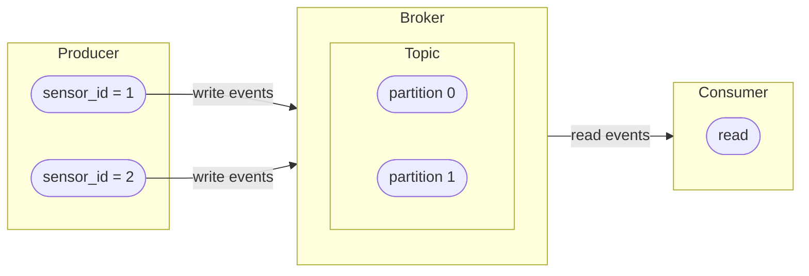

## Repository Structure

- **src/producer.py** — generates temperature measurements for 2 sensors (`sensor_id=1` and `sensor_id=2`) by drawing randomly from Gaussian (Normal) distribution. 

- **src/consumer.py** — generates temperature measurements for 2 sensors (`sensor_id=1` and `sensor_id=2`) by drawing randomly from Gaussian (Normal) distribution. 

- **Dockerfile** — Python 3.11-slim image, installs dependencies from pyproject.toml, copies both scripts (`consumer.py` and `producer.py`)

- **docker-compose.yml** — Orchestrates 4 services:
    - **broker** — Apache Kafka 3.9.0 in KRaft mode (no ZooKeeper), exposed on port 9092, with a healthcheck
    - **init-topics** — One-shot container that creates `topic-sensor-values-temperature` with 2 partitions (for each sensor ID a partition, waits for broker to be healthy)
    - **producer** — Runs `producer.py` at 1 msg/s, connected to broker:19092
    - **consumer** — Runs `consumer.py`, prints readings with partition info, connected to broker:19092

- **.dockerignore** — Excludes .venv, .git, etc. from the Docker build context

## Service Architecture


## Running Services (i.e. Producer, Broker and Consumer)
First install [Docker Desktop](https://docs.docker.com/desktop/) on your local machine. 
Then build the 4 services using Docker compose:
```bash
docker compose build
```

Then start the full stack (4 services i.e. broker, topic initialization, producer and consumer) with:
```bash
docker compose up -d
```

Check that topic was created by:
```bash
docker compose logs init-topics
```

Now follow the logs by:
```bash
docker compose logs init-topics
```

You should observe the following:
```bash
docker compose logs producer
```
The producer is sending JSON sensor events keyed by `sensor_id`.

And with
```bash
docker compose logs consumer
```
the consumer is printing received messages (containing `sensor_id`, `temperature_value`, `event_time`) with together with their partition number — demonstrating that records with the same `sensor_id` always land in the same partition. Press `Ctrl+C` to stop printing in the console. 

Finally,
```bash
docker compose logs -f --tail 1 producer consumer
```
prints both producer logs and consumer logs alternately.
While both producer and consumer are running, you can stop the `consumer service` in Dockerdesktop. `consumer exited with code 137` is displayed and you should observe that only sent messages are logged. Restart the `consumer service` and the consumer logs should become visible again, including all the messages that have been sent to and stored by the Kafka broker, but have not been consumed yet by the consumer. This is possible due to the offset commited by the consumer and stored in the Kafka offset topic.

