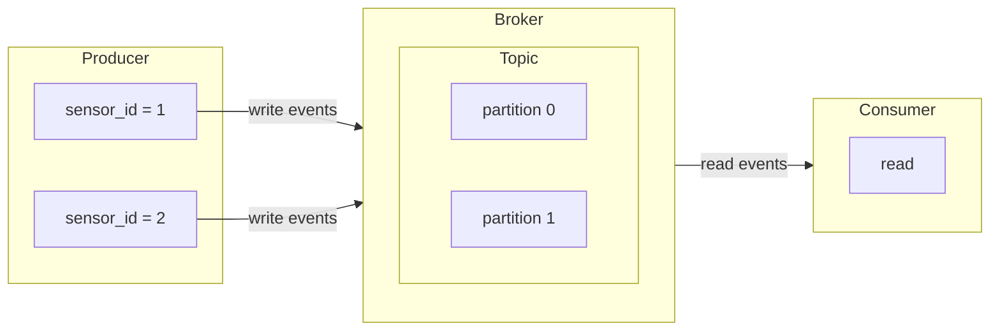

## Repository Structure

- **src/producer.py** — generates temperature measurements for 2 sensors (`sensor_id=1` and `sensor_id=2`) by drawing randomly from Gaussian (Normal) distribution. 

- **src/consumer.py** — generates temperature measurements for 2 sensors (`sensor_id=1` and `sensor_id=2`) by drawing randomly from Gaussian (Normal) distribution. 

- **Dockerfile** — Python 3.11-slim image, installs dependencies from pyproject.toml, copies both scripts (`consumer.py` and `producer.py`)

- **docker-compose.yml** — Orchestrates 4 services:
    - **broker** — Apache Kafka 3.9.0 in KRaft mode (no ZooKeeper), exposed on port 9092, with a healthcheck
    - **init-topics** — One-shot container that creates `topic_raw_temp_sensor_values` with 2 partitions (for each sensor ID a partition, waits for broker to be healthy)
    - **producer** — Runs `producer.py` at 1 msg/s, connected to broker:19092
    - **consumer** — Runs `consumer.py`, prints readings with partition info, connected to broker:19092

- **.dockerignore** — Excludes .venv, .git, etc. from the Docker build context

## Service Architecture

## Running Services (i.e. Producer, Broker and Consumer)
start the full stack with:

docker compose build

docker compose up -d

docker compose ps

Then follow the logs:
- producer sending JSON sensor events keyed by sensor_id
- consumer printing them with their partition number — demonstrating that records with the same sensor_id always land in the same partition